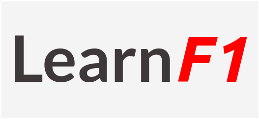

Learn Formula 1 by browsing through current and historical data about the biggest Motorsport event of all time.

## Development

---

### 1. Clone the repository:

```shell
git clone git@github.com:vantage-ola/Learn-Formula1.git
```

### 2. Create your branch:

Name your branch based on the feature you are working on. For example, Writing README branch would be called `feature/write_readme`:

```shell
git checkout -b <your branch name>
```

### 3. Start the application:

Runs the app in the development mode.

```shell
npm start
```

## Resources

---

Formula 1 API from [Ergast](https://ergast.com/mrd/)

Stock images from [FlatIcon](www.flaticon.com)
